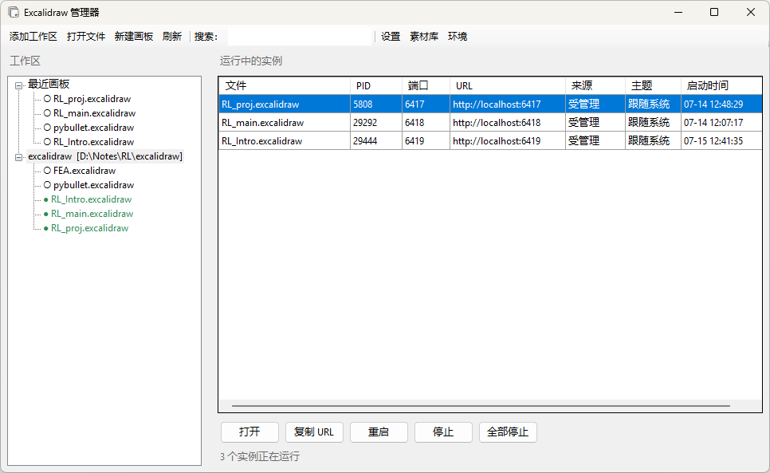
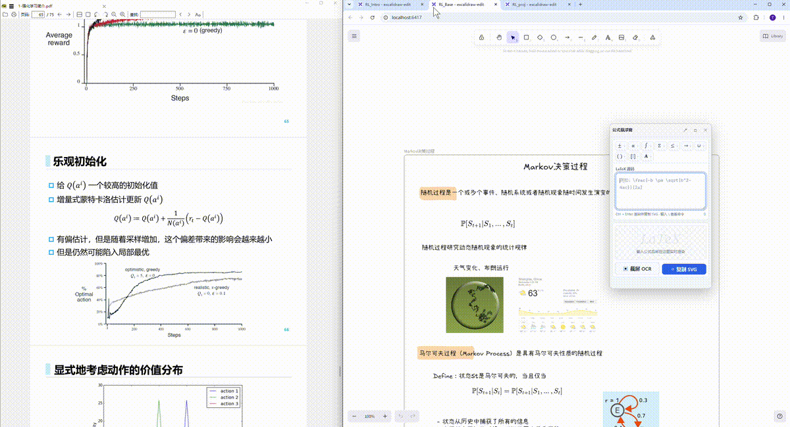

# Excalidraw Manager

[简体中文](README.zh-CN.md) | English

Excalidraw Manager is a lightweight Windows 10/11 desktop application for
organizing and running multiple local `.excalidraw` boards. It adds a native
WinForms manager, process controls, a system tray, and one shared local library
on top of [`excalidraw-edit`](https://github.com/wh1le/excalidraw-edit).

The application is local-first: boards and settings stay on your computer.
Managed board servers listen only on `127.0.0.1`.

> This is an independent project and is not affiliated with or endorsed by
> Excalidraw.

## Features

- Manage multiple workspace roots with a lazy-loaded `.excalidraw` file tree.
- Create boards and folders without leaving the application.
- Start, open, restart, and stop several boards on separate ports.
- Select a free port automatically from 6417, or assign one manually.
- View PID, port, URL, source, theme, start time, path, and command line.
- Discover compatible `excalidraw-edit` processes started in other terminals.
- Open recent boards from the system tray.
- Forward board paths to the existing window through single-instance IPC.
- Persist one shared Excalidraw library across all managed boards and ports.
- Import, merge, replace, export, clear, and browse public libraries.
- Use `list` and `stop-all` from a terminal.
- Follow the Windows display language automatically or switch between English
  and Simplified Chinese from the application settings.

## Screenshots

### Manager interface

Manage local boards, ports, and running services from one Windows desktop
window.

<p align="center">
  
</p>

### Excalidraw note editing

Open each managed board in the browser and edit it with the full Excalidraw
canvas.

<p align="center">
  
</p>

## Supported environment

| Component | Requirement |
| --- | --- |
| Operating system | Windows 10 or Windows 11, 64-bit |
| PowerShell | Windows PowerShell 5.1 or newer |
| Node.js | 20.11.0 or newer; tested with 24.18.0 |
| `excalidraw-edit` | **Exactly 0.1.1** |
| Source builds | Windows .NET Framework 4.x C# compiler (`csc.exe`) |
| Browser | A current Chromium-, Firefox-, or WebView-compatible browser |

`excalidraw-edit` is pinned because the managed-library integration patches
specific client markers from version 0.1.1. A different version is rejected
instead of producing a subtly broken build.

Node.js and `excalidraw-edit` are external prerequisites; they are not bundled
in the executable or repository. Custom installation directories are supported
as long as `node.exe` and `excalidraw-edit.cmd` are on `PATH`.

## Quick start from source

1. Install Node.js, then open a **new** PowerShell window.
2. Install the compatible editor globally:

   ```powershell
   npm install --global excalidraw-edit@0.1.1
   ```

3. In the project directory, verify the environment:

   ```powershell
   powershell -NoProfile -ExecutionPolicy Bypass -File .\check-environment.ps1
   ```

4. Build and install for the current Windows user:

   ```powershell
   powershell -NoProfile -ExecutionPolicy Bypass -File .\install.ps1
   ```

5. Open a new terminal and start the manager:

   ```powershell
   excalidraw-manager
   ```

The default installation directory is:

```text
%LOCALAPPDATA%\Programs\ExcalidrawManager
```

`install.ps1` adds this directory to the current user's `PATH`. It does not
require administrator rights.

## Install a prebuilt package

If a package already contains the four tested files below, it can be installed
without recompiling:

```text
dist\ExcalidrawManager.exe
dist\ExcalidrawManager.Cli.exe
dist\runtime\main.js
dist\runtime\server.mjs
```

After installing the Node.js and `excalidraw-edit@0.1.1` prerequisites, run:

```powershell
powershell -NoProfile -ExecutionPolicy Bypass -File .\install.ps1 -SkipBuild
```

For portable use, keep the complete `dist` directory together and launch
`dist\ExcalidrawManager.exe`. The `runtime` directory must remain beside the
executable.

## Usage

The GUI can add one or more workspace roots. Double-click a board or use the
toolbar to start it, then open its local URL in your default browser. Use
**Environment** to see the resolved Node.js, `excalidraw-edit`, runtime,
library, and settings paths.

Terminal commands:

```powershell
excalidraw-manager                         # Open the GUI
excalidraw-manager .\board.excalidraw     # Open a board through the GUI
excalidraw-manager list                    # List compatible running instances
excalidraw-manager stop-all                # Stop every discovered compatible instance
excalidraw-manager --version
```

Be careful with `stop-all`: it also stops compatible `excalidraw-edit`
processes launched outside this manager.

## Interface language

The default **Follow system** setting uses Simplified Chinese when the Windows
display language is Chinese and English otherwise. To choose explicitly, open
**Settings → Interface language** and select **Simplified Chinese** or
**English**. The manager restarts its interface to apply the change; running
board services remain open.

The selected value is stored as `Language` in
`%LOCALAPPDATA%\ExcalidrawManager\settings.json`. The command-line companion
follows the Windows display language.

## Local data and backups

User data is stored outside the installation directory:

| Data | Location |
| --- | --- |
| Settings and workspace roots | `%LOCALAPPDATA%\ExcalidrawManager\settings.json` |
| Shared library | `%LOCALAPPDATA%\ExcalidrawManager\libraries\shared.excalidrawlib` |
| Managed-process registry | `%LOCALAPPDATA%\ExcalidrawManager\managed-processes.json` |
| Boards | Wherever the user creates the `.excalidraw` files |

Back up the `.excalidraw` files and `shared.excalidrawlib` to preserve all
local content. Reinstalling the program does not intentionally remove these
files.

Library changes made in one managed board are written to the shared library.
Refresh already-open board tabs after importing, replacing, or clearing the
library from the manager. Public library imports accept HTTPS URLs from
`libraries.excalidraw.com` only.

## Build and test

No .NET SDK or NuGet restore is required. `build.ps1` uses the 64-bit .NET
Framework C# compiler included with supported Windows installations and
generates the managed browser client from the installed `excalidraw-edit`
package.

```powershell
powershell -NoProfile -ExecutionPolicy Bypass -File .\build.ps1
powershell -NoProfile -ExecutionPolicy Bypass -File .\tests\smoke.ps1
powershell -NoProfile -ExecutionPolicy Bypass -File .\tests\localization.ps1
```

The smoke test creates a temporary board, starts one local Node.js process,
checks the scene/library/client endpoints, and stops only the PID that it
created. The localization test validates Chinese and English strings, language
preference handling, and version metadata without modifying user settings.

Project layout:

```text
assets/                  Application icon sources
dist/                    Tested Windows payload
runtime/                 Local HTTP runtime and browser-client patcher
src/                     WinForms GUI and command-line launcher
tests/                   PowerShell smoke test
build.ps1                Reproducible local build
check-environment.ps1    Prerequisite diagnostics
install.ps1              Per-user installer
```

## Troubleshooting

### `node.exe` or `excalidraw-edit` cannot be found

Open a new terminal after installing Node.js, then inspect command resolution:

```powershell
Get-Command node.exe
Get-Command excalidraw-edit.cmd
node --version
excalidraw-edit --version
npm root --global
```

If `excalidraw-edit` is missing or has another version:

```powershell
npm uninstall --global excalidraw-edit
npm install --global excalidraw-edit@0.1.1
```

If you use a custom npm prefix, add the directory containing
`excalidraw-edit.cmd` to your user `PATH`, then open a new terminal.

### PowerShell blocks a script

The documented commands use `-ExecutionPolicy Bypass` for that process only;
they do not permanently change the machine's execution policy.

### The C# compiler is missing

Run `check-environment.ps1` to see the expected path. Source builds require:

```text
%WINDIR%\Microsoft.NET\Framework64\v4.0.30319\csc.exe
```

Use `install.ps1 -SkipBuild` with a complete prebuilt package, or repair/enable
the Windows .NET Framework components before building from source.

### A board does not start

- Check that the requested port is free, or use automatic port selection.
- Run `check-environment.ps1` and correct every `[FAIL]` entry.
- Confirm that `dist\runtime\server.mjs` and `dist\runtime\main.js` are beside
  the executable in the `runtime` directory.
- Use the GUI's **Environment** dialog to confirm the paths actually selected.

## Security and network behavior

Managed services bind to `127.0.0.1` and have no remote-access authentication.
Do not modify the runtime to listen on a public interface unless you also add
appropriate authentication, authorization, TLS, and request protections.

Normal local editing does not require an online service. Network access is
used when installing npm prerequisites and when the user explicitly imports
an official public library.

## Contributing

Keep changes compatible with Windows PowerShell 5.1 and the built-in .NET
Framework compiler. Before opening a pull request, run both `build.ps1` and
`tests\smoke.ps1`, and avoid committing personal board files or local settings.

## License

Excalidraw Manager is available under the [MIT License](LICENSE). Bundled or
referenced third-party components retain their own copyright and license
terms; see [THIRD_PARTY_NOTICES.md](THIRD_PARTY_NOTICES.md).
